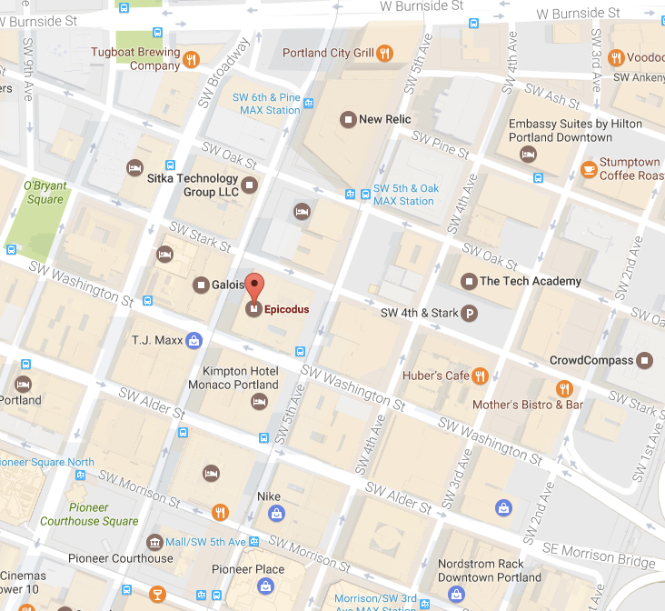

# Battleship

This month's PDX magic night will be to to create the popular childrens' game [Battleship](https://en.wikipedia.org/wiki/Battleship_(game))

Constraints:

- Played on a grid, typically 10 X 10
- There are two phases of the game
  - Setup, where each player secretly places their ships on the grid vertically or horizontally
    - ships can not overlap
    - ships can not be placed diagonally
    - Each player has the same set of ships, in the original game, the following ships were in play
      - Carrier: size 5
      - Battleship: size 4
      - Cruiser: size 3
      - Submarine: size 3
      - Destroyer: size 2
  - Game play, where each player guesses a grid location where his/her opponent may have placed a ship
  - When all of the ships of one of the players has been struck on all ships in all grid locations, the game is over and a winner is declared

Outside of these constraints you may implement it as text based or any graphical
way you choose.

# PDX Magic Night

Come hungry, we'll have pizza and drinks.

### **Note the New location!

Epicodus, 
400 SW 6th Ave #800, 
Portland, OR 97204

### When

Tuesday, April 11th.  6:00

